---
# Webpage modeled after https://silviacanelon.com/about/
# title: "Ochotona Properties"
pagetitle: "Ochotona Properties"  # this goes in the browser tab
navbar: false
toc: false
image: images/jpeg/street_view_1.jpeg

about:
  template: trestles
  image-width: 30em
  image-shape: rounded
  id: hero-heading

lightbox: 
  match: auto
  effect: fade
  desc-position: bottom
  loop: true
  
format: 
  html: 
    # page-layout: full
    grid:
      sidebar-width: 250px
      body-width: 800px
      margin-width: 250px
      gutter-width: 2rem

header-includes:
  <link rel="stylesheet" href="assets/about.css">

resources:
  - assets/about.css

# filters:
  # - lightbox
  # - masonry
---

<link rel="icon" type="image/png" href="favicon_color.png" />

::: {style="text-align:center"} 

A Place to Call Home &nbsp;&bull;&nbsp; 259 W. 31^st^ Street

:::

::::: {#hero-heading}
   

::: h4
Quick Info
:::

-   3 bedrooms / 2.5 baths
-   1850 sq. ft.
-   Private, fenced backyard
-   1-car garage
-   \$2950/mo (includes city utilities)

 

::: h4
<a href="https://apply.link/DRRgCVk" target="_blank" style="color:#0b66c3; text-decoration: underline" title="Send an email">**Apply Here!**</a> <!-- [**Apply Here!**](https://apply.link/DRRgCVk){target="_blank"} -->
:::
:::::

### In the Heart of Animas City

This lovely duplex is a great place to settle in and feel at home. The large eat-in kitchen has tons of counter space and storage and opens up to a bright, spacious living area—perfect for cooking, hanging out, or entertaining. Big living room windows look out toward Smelter Mountain and the historic Animas City Museum, bringing in great light and views.

The primary bedroom is upstairs and features its own private balcony patio with beautiful views—an ideal spot for morning coffee or winding down at the end of the day. The home has three bedrooms and two-and-a-half bathrooms, offering plenty of space to spread out.

You’ll also enjoy a private, fenced backyard, a large one-car garage, and attractive xeriscaping that keeps outdoor maintenance simple and water use low. The location is hard to beat—walk or bike to trailheads, coffee shops, restaurants, groceries, and the river path, all nearby.

The other side of the duplex is owner-occupied by quiet, respectful, local professionals. This is a comfortable, well-cared-for home in a fantastic neighborhood.

Monthly rent of \$2950 includes city water and trash. No pets, no smoking. [Apply today](https://apply.link/DRRgCVk){target="_blank"} through RentSpree if interested!

Please send us a <a href="mailto:ochotonaproperties@gmail.com" style="color:#0b66c3; text-decoration: underline" title="Send an email">message</a> if you have questions.

------------------------------------------------------------------------

::: {layout-ncol="3"}
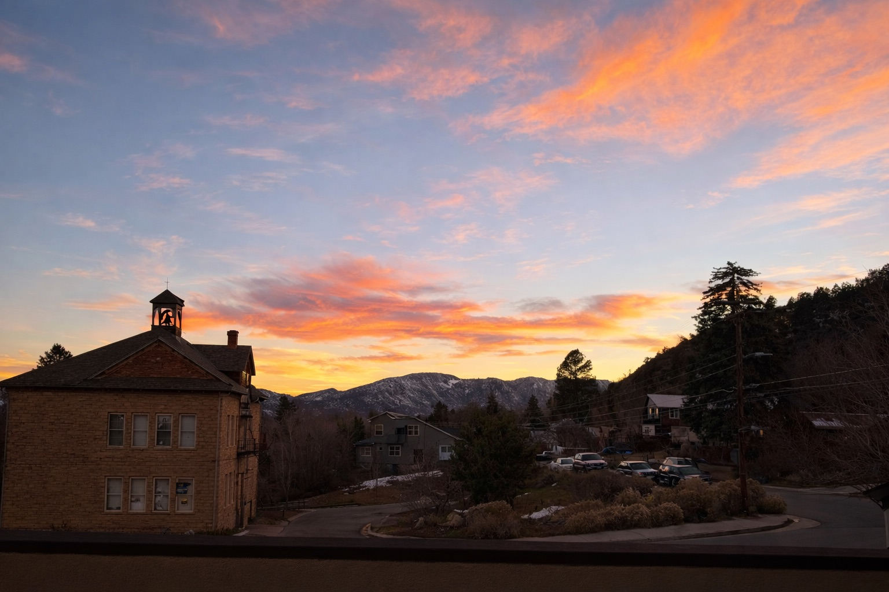{.lightbox group="my-gallery" description="View from second floor patio"}

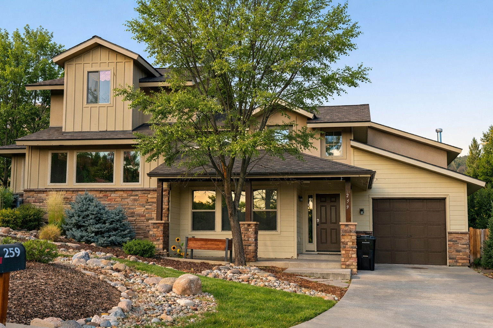{.lightbox group="my-gallery" description="Street view"}

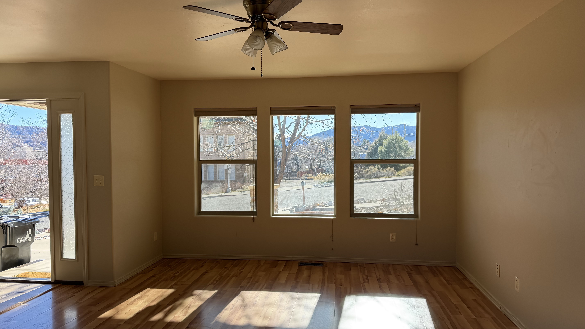{.lightbox group="my-gallery" description="Living room light"}

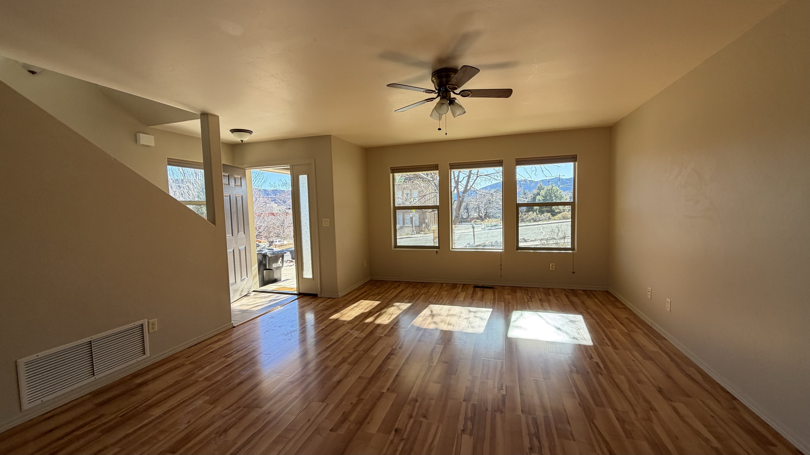{.lightbox group="my-gallery" description="Living room looking south"}

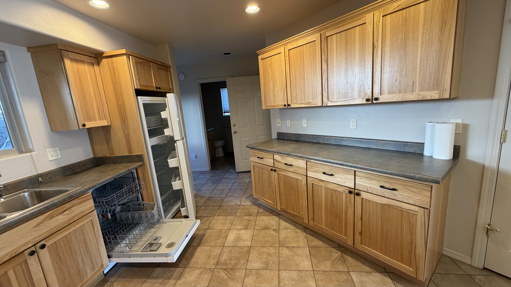{.lightbox group="my-gallery" description="Large kitchen with a lot of storage"}

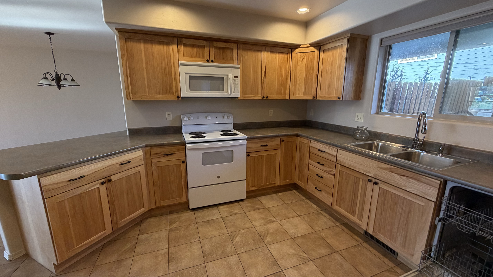{.lightbox group="my-gallery" description="Large kitchen"}

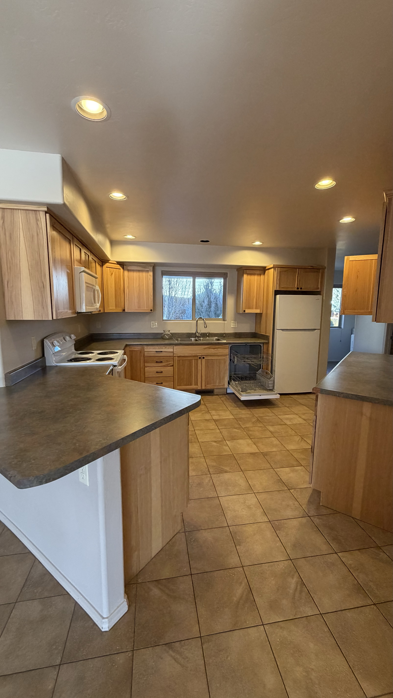{.lightbox group="my-gallery" description="Large eat in kitchen"}

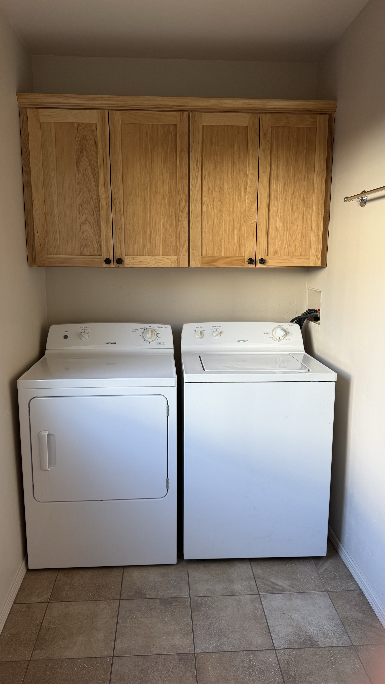{.lightbox group="my-gallery" description="Laundry nook"}

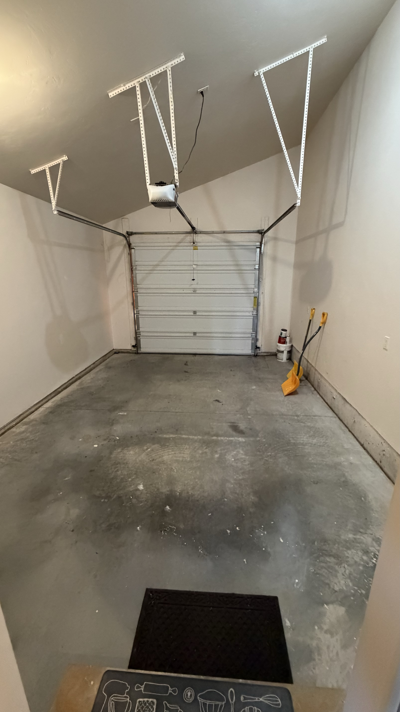{.lightbox group="my-gallery" description="Oversized one-car garage"}

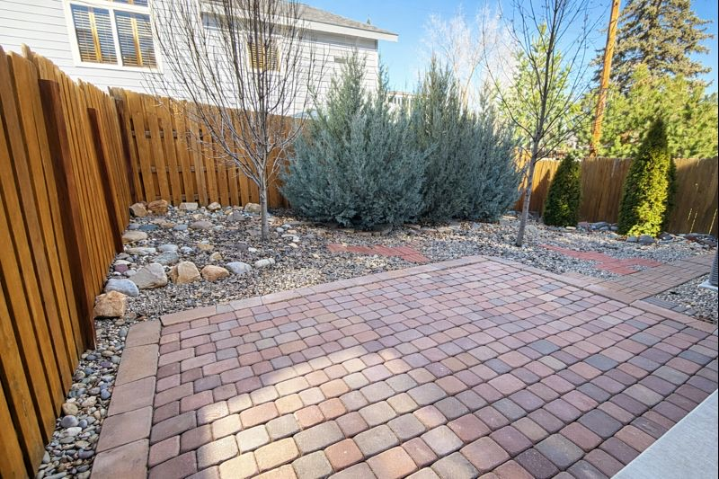{.lightbox group="my-gallery" description="Fenced backyard with patio"}

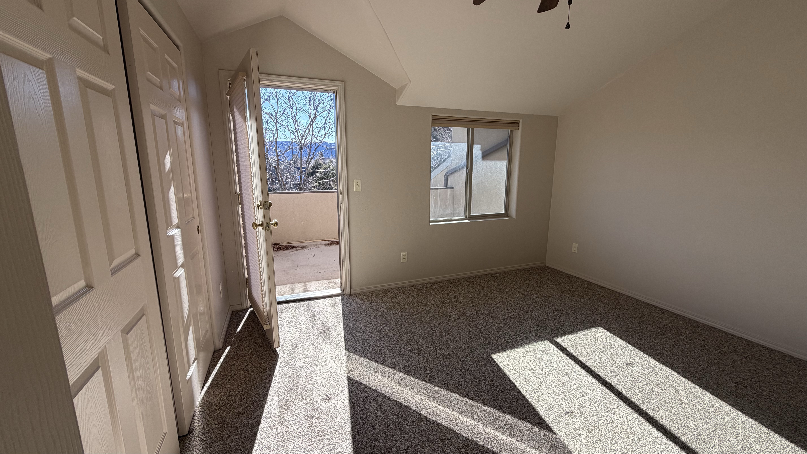{.lightbox group="my-gallery" description="Primary bedroom with patio/balcony"}

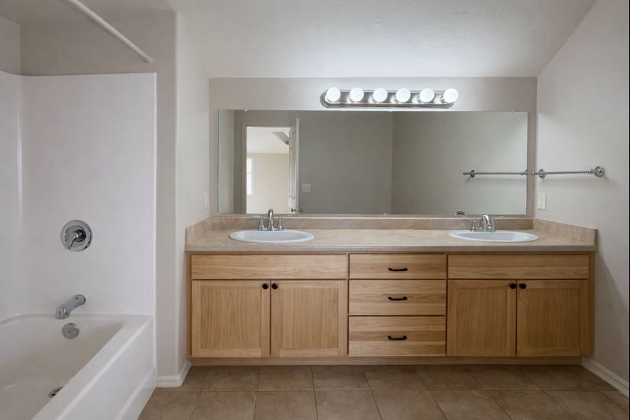{.lightbox group="my-gallery" description="Primary bathroom with double vanity"}

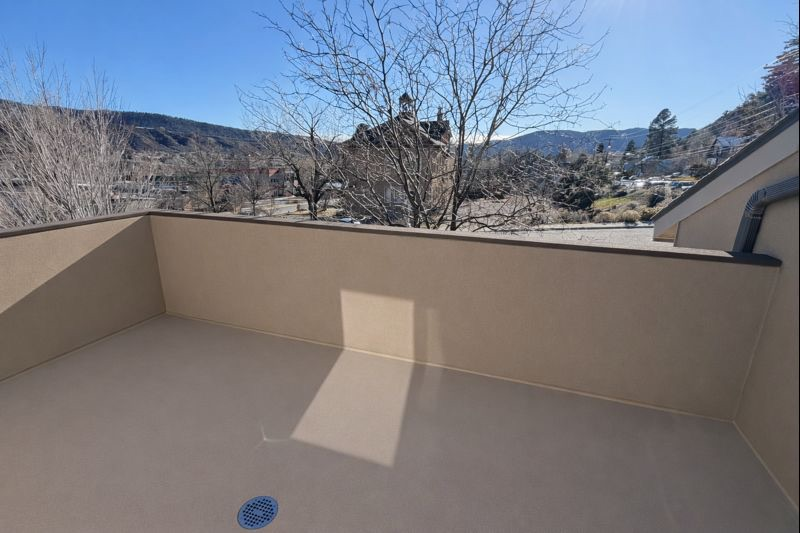{.lightbox group="my-gallery" description="Second floor patio/balcony"}

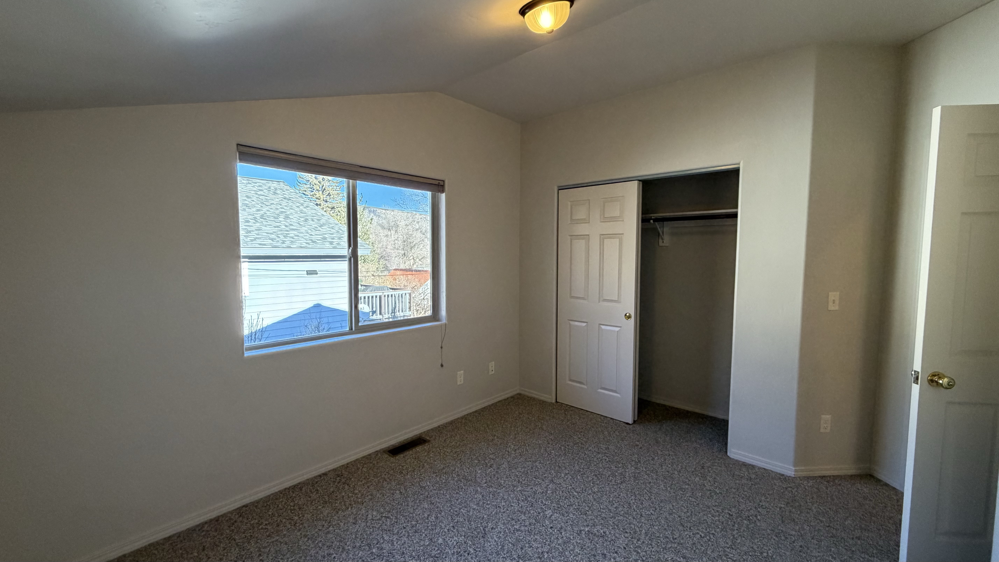{.lightbox group="my-gallery" description="Bedroom #2"}

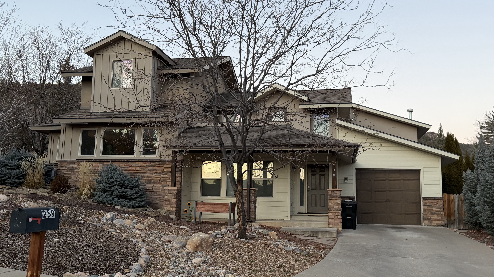{.lightbox group="my-gallery" description="Street view (winter)"}

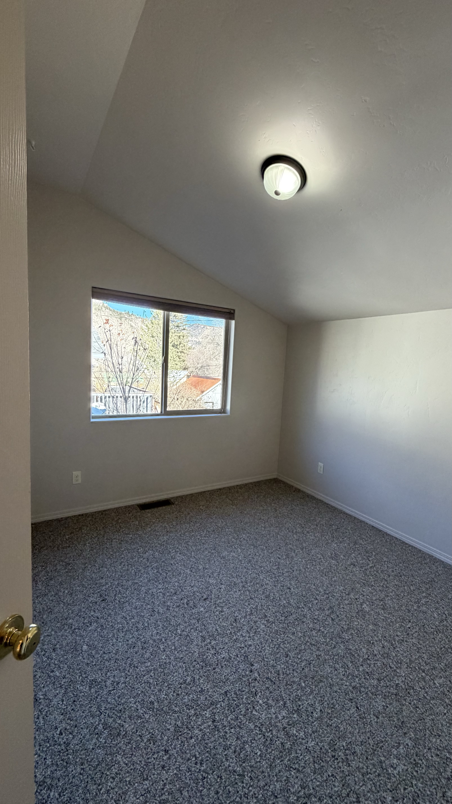{.lightbox group="my-gallery" description="Bedroom #3"}

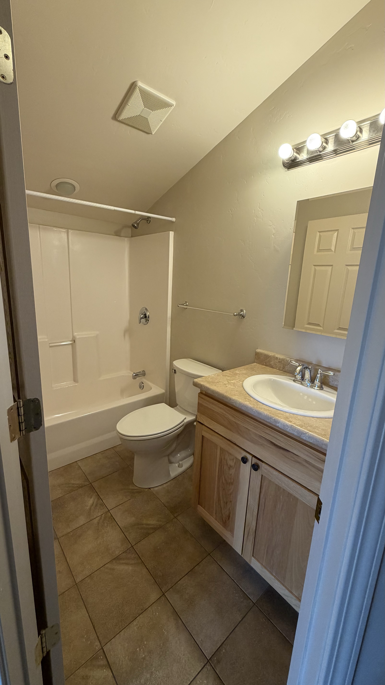{.lightbox group="my-gallery" description="Second full bath"}

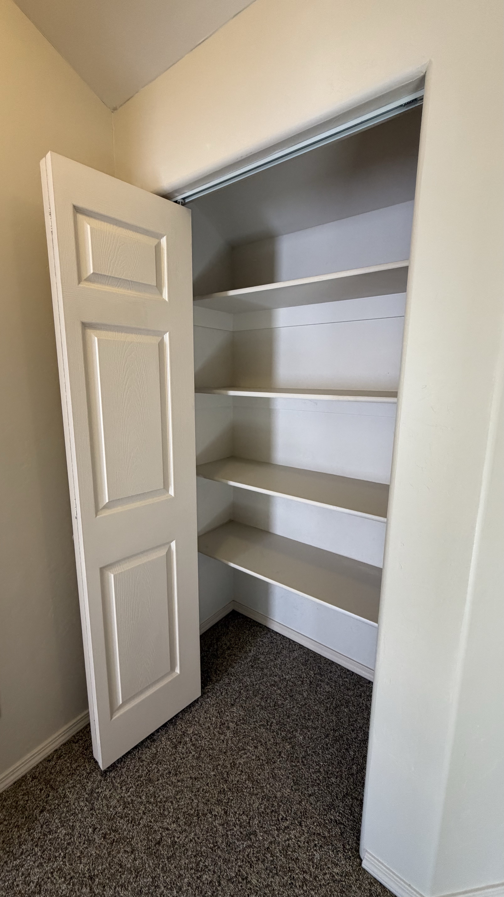{.lightbox group="my-gallery" description="Linen closet"}
:::

::: column-page
<footer class="footer-main">

Ochotona Properties © 2026

</footer>
:::
